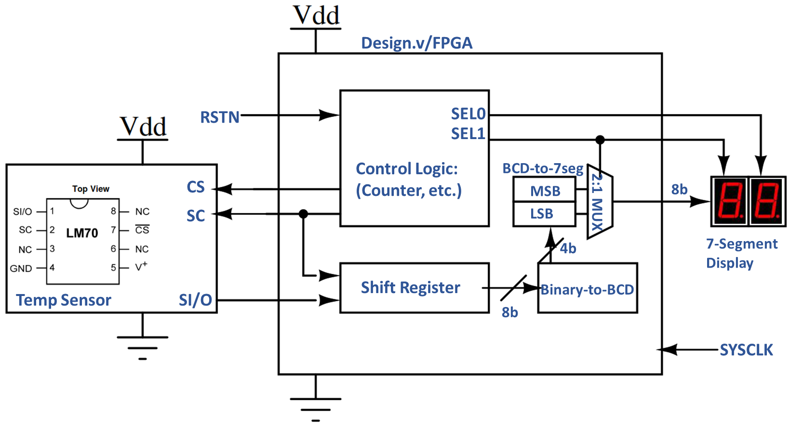
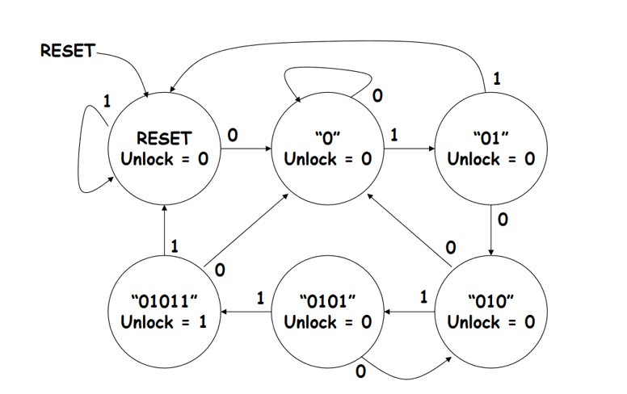
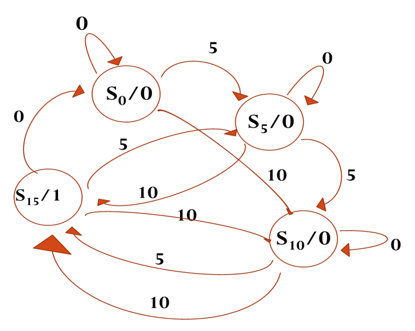

# PROJECTS

## SPI-based TEMPERATURE MONITOR

This project will aim at design and immplemention of a SPI-based temperature monitor. The students will design a controller in Verilog to read the data from the sensor ([LM70][datasheetLM70]) using the industry-standard SPI protocol, convert the data to a human readable format (deg-C) and drive a set of 7-segment display to display the data. In order to test the Verilog code in realtime application, the Verilog code will be synthesized into a Xilinx's Spartan FPGA board. This will allow the students to test their Verilog code in real time.

**SOME USEFUL LINKS**

- [An easy-to-read SPI tutorial from sparkfun](https://learn.sparkfun.com/tutorials/serial-peripheral-interface-spi)
- [Datasheet: TI SPI-based temperature sensor LM70][datasheetLM70]
- [Technical Reference: Xilinx Spartan-6 FPGA Development Board][TechRefSpartan6]

## Electronic Lock

- Design an electronic combination lock using sequence detection and FSM. 
- The lock has a reset button, two number buttons (0 and 1), and an unlock output. 
- The combination to unlock the device is 01011.
  
The lock works by detecting the correct sequence of button presses and then outputting a signal to unlock the device. The FSM design ensures that the lock can only be unlocked with the correct combination.

## Vending Machine

[datasheetLM70]:	https://www.dropbox.com/s/ot6h1511lpuxlmx/datasheet-LM70-TI-tempSensor.pdf	
[TechRefSpartan6]:	https://www.dropbox.com/s/s53w0m665e083ni/AHMY_SP6LX9_LT_Spartan6-TechRef.pdf
